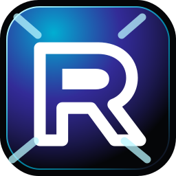

<p align="center">
  
</p>

<h1 align="center">RKix Storage Center</h1>

<p align="center">
  <strong>Dark, minimal and AI-ready storage control plane for project teams.</strong>
</p>

<p align="center">
  <a href="https://react.dev"></a>
  <a href="https://vite.dev"></a>
  <a href="https://www.typescriptlang.org"></a>
  <a href="https://ai.google.dev"></a>
</p>

<p align="center">
  
  
  
  
</p>

---

## Preview

```bash
npm ci
cp .env.example .env
npm run dev
```

Open: **http://localhost:3000**

> AI Copilot requires a valid `GEMINI_API_KEY` in `.env`.

## What ships in v1.0

- Premium dark UI shell with animated glass background, minimal RKix logo and release-ready landing hero.
- Unified dashboard for projects, storage usage, backups, archives, notifications and audit logs.
- Project registry with search, create/edit/delete, repository connection test and Git action simulations.
- Storage Explorer for virtual folders/files, rename, move, delete and Trash cleanup.
- Backup and Archive centers for snapshot/restore and ZIP export simulations.
- Gemini-powered AI Copilot endpoint with live project/storage context.

## Stack

| Layer | Tools |
| --- | --- |
| Frontend | React 19, Vite, TypeScript, Tailwind CSS v4, Recharts, lucide-react, motion |
| Backend | Node.js, Express, TypeScript, tsx, esbuild |
| AI | Google Gemini via `@google/genai` |
| Runtime Store | Local `data_store.json` generated by the server |

## Commands

| Command | Purpose |
| --- | --- |
| `npm run dev` | Start Express + Vite development server. |
| `npm run lint` | Type-check with TypeScript. |
| `npm run build` | Build frontend and production server bundle. |
| `npm run check` | Run lint and build together. |
| `npm run start` | Run the production bundle from `dist/server.cjs`. |

## Project map

```text
.
├── public/rkix-logo.svg          # Minimal RKix logo and favicon source
├── src/components/RKixLogo.tsx   # Reusable UI logo component
├── src/App.tsx                   # Main product UI and workflows
├── src/index.css                 # Design tokens, animations and global polish
├── server.ts                     # Express API and Vite/static serving
├── docs/                         # Development, architecture and API docs
└── .github/                      # CI workflow and PR template
```

## Docs

- [Development Guide](docs/DEVELOPMENT.md)
- [Architecture Overview](docs/ARCHITECTURE.md)
- [API Reference](docs/API.md)
- [Contributing](CONTRIBUTING.md)

## Sponsors & AI partners

RKix Storage Center is prepared for sponsor visibility and AI-enabled product demos. Replace the badges above with real sponsor URLs when the public sponsorship page is available.

## Security notes

- Never commit `.env`, secrets, `data_store.json`, `dist`, `node_modules` or logs.
- The local JSON store is for demo/development only, not multi-user production persistence.
- Move secrets to a managed secret store before deploying beyond local demo.
